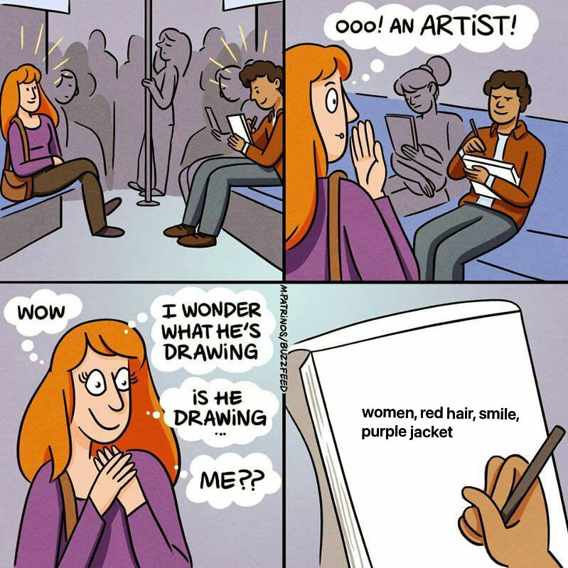

# Stable-Diffusion-Image-to-Prompts

Stable-Diffusion Image-to-Prompt is a cutting-edge machine learning project that predicts text prompts from given images. By leveraging the power of the ViT-GPT2, CLIP + Prompt, and ViT models, this project achieved a 0.54 (Top 20%) score in a Kaggle competition.

Kaggle Link: https://www.kaggle.com/competitions/stable-diffusion-image-to-prompts

## Features
 - Predict text prompts from images
 - Utilizes ViT-GPT2, CLIP + Prompt, and ViT models

## Baseline Used:
1. Vit-GPT2
2. BLIP + CLIP
3. ViT
## Getting Started

### Prerequisites
- [Python 3.8+](https://www.python.org/downloads/)
- [PyTorch 1.9+](https://pytorch.org/get-started/locally/)
- [torchvision 0.10+](https://pypi.org/project/torchvision/)
- [torchtext 0.9+](https://pypi.org/project/torchtext/)
- [Hugging Face Transformers 4.9+](https://huggingface.co/transformers/)

## Installation
